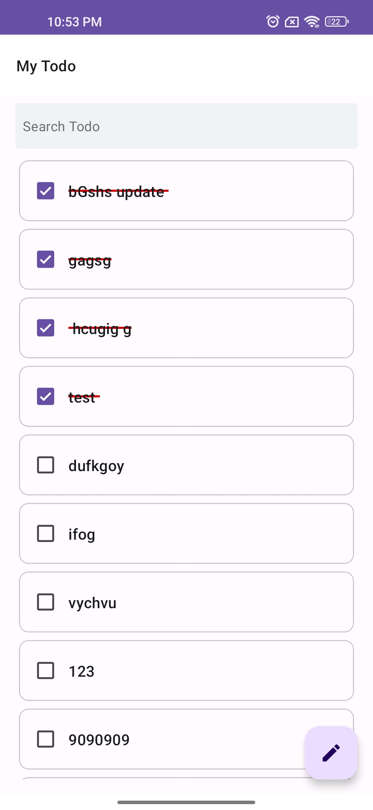
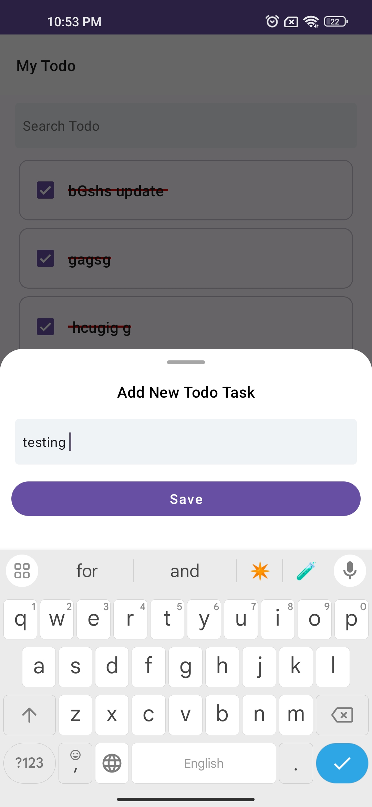
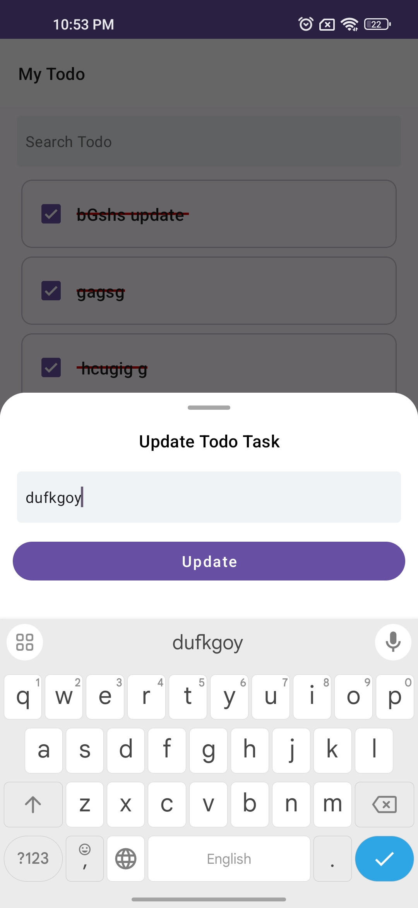
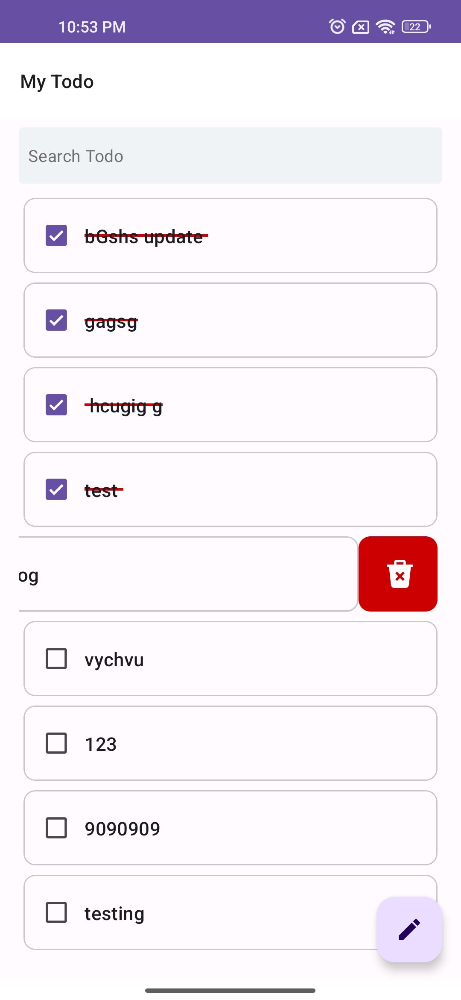
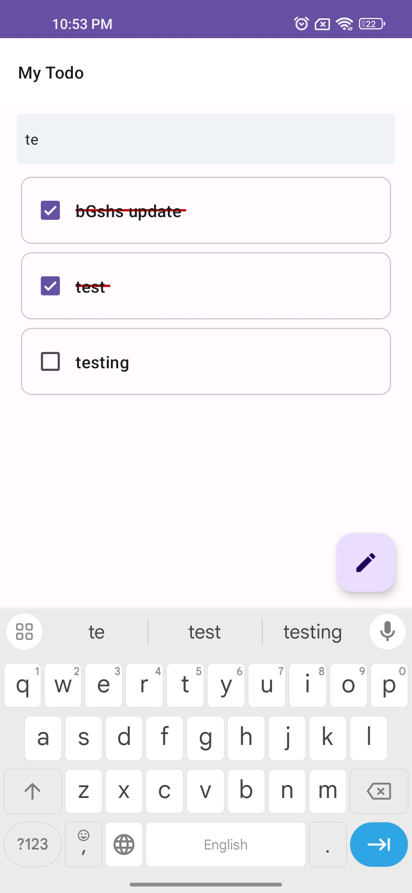

# Code Test
## My Todo App

> ## Download app
<a href="https://github.com/aungbophyoe/TodoApp/tree/master/app/release/todo-app-release.apk">MyTodo App</a>

> ### Todo Task

 

> ### Add new Todo task

 

> ### Update Todo task

 

> ### Delete Todo task

 

> ### Search Todo task

 

> ### Dependencies

- <a href="https://developer.android.com/training/dependency-injection/hilt-android">Dagger Hilt</a>
- <a href="https://developer.android.com/topic/libraries/architecture/viewmodel">ViewModel</a>
- <a href="https://developer.android.com/jetpack/androidx/releases/room">Room Database</a>
- <a href="https://developer.android.com/kotlin/coroutines">Coroutines</a>
- <a href="https://orbit-mvi.org/">Orbit</a>

> #### Developed by aungbophyoe